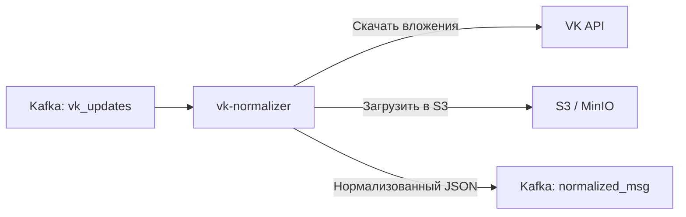
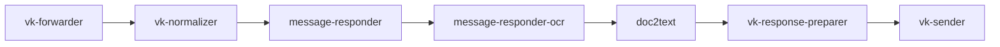

## О приложении

vk-normalizer принимает события из Callback API ВКонтакте (которые уже положил `vk-forwarder`), нормализует структуру, скачивает вложения по прямым URL и размещает файлы в S3/MinIO. На выходе публикуется `NormalizedMessage` с текстом, метаданными и ссылками на объекты хранилища.

## Роль приложения в архитектуре проекта

Сервис идёт сразу после входного вебхука VK:


Он снимает с downstream‑части необходимость работать с HTTP ВКонтакте: после нормализатора все компоненты читают единый формат и обращаются только к Kafka+S3.

## Локальный запуск

1. Требования: Go ≥ 1.24, доступ к Kafka и к S3 (например, MinIO). Forwarder должен складывать события в `KAFKA_TOPIC_NAME_VK_UPDATES`.
2. Экспортируйте переменные:
   - Kafka (`KAFKA_`): `KAFKA_BOOTSTRAP_SERVERS_VALUE`, `KAFKA_GROUP_ID_VK_NORMALIZER`, `KAFKA_TOPIC_NAME_VK_UPDATES`, `KAFKA_TOPIC_NAME_NORMALIZED_MSG`, `KAFKA_CLIENT_ID_VK_NORMALIZER`, опционально `KAFKA_SASL_USERNAME`/`KAFKA_SASL_PASSWORD`.
   - S3 (`S3_`): `S3_ENDPOINT`, `S3_ACCESS_KEY`, `S3_SECRET_KEY`, `S3_BUCKET`, `S3_USE_SSL`.
3. Запустите сервис:
   ```bash
   go run ./cmd/vk-normalizer
   ```
   или через Docker.
4. Убедитесь, что файлы появляются в бакете, а JSON‑сообщения с полем `media[].s3_url` пишутся в `KAFKA_TOPIC_NAME_NORMALIZED_MSG`. Ошибки загрузки приведут к повторной обработке того же offset.
